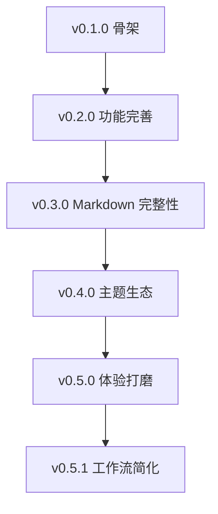

## 缘起

这是我第三次搭建个人博客。

- 第一次：Hugo + 不知名主题，工作流混乱、完全不好用。
- 第二次：Hugo + PaperMod 主题，从 2024 年用到 2026 年，期间写了 91 篇文章
- 第三次：**自己写一个**

为什么不用 Hugo 了？

> Hugo 很好，但它太庞杂了。Go template 语法别扭、中文社区支持差、PaperMod 主题里到处都是我永远也用不上的配置项。我想要一个更轻、更符合自己需求的工具。

于是我花了一个下午，从零写了一个 Go 语言的静态博客生成器。名字叫 **Chenhai**，取自碧蓝航线角色「镇海」——我的秘书舰。

> [!note]
> 镇海是我在碧蓝航线中最喜欢的角色。文静内敛、常年伏案处理文书——很适合做一个博客主题的意象。这次的主题设计就是围绕她展开的：**水墨为底、金线点睛、大巧不工**。

## 技术选型

| 层 | 选型 | 理由 |
|------|------|------|
| Markdown 解析 | Goldmark | Go 生态最成熟的 Markdown 引擎 |
| 代码高亮 | Chroma | Hugo 同款，200+ 语言支持 |
| 模板引擎 | Go html/template | 编译期类型安全，性能好 |
| CLI 框架 | Cobra | Go 社区标准 |
| YAML 解析 | yaml.v3 | 简洁稳定 |
| 文件监听 | fsnotify | 跨平台文件变更通知 |

## 版本演进

整个项目在一个下午完成了基础架构，后续逐步迭代到现在。



### v0.1.0 — 核心骨架

```go
// chenhai 最初的入口
func main() {
    fmt.Println("Chenhai - 镇海")
}
```

一个下午搭好 6 个 internal 包：config / content / theme / build / index / server。第二天就能跑通 `chenhai build`。

### v0.2.0 — 功能完善

```yaml
# Admonition Goldmark 扩展 — v0.2 的亮点
> [!note]
> 这是一个提示框

> [!warning]
> 这是一个警告
```

三种类型分别渲染为不同的 CSS 样式。还加入了分页、Favicon、标签云五级字号。

### v0.3.0 — Markdown 渲染完整性

这是最重要的一次更新。之前 KaTeX 和 Mermaid 只保留了分隔符但没有真正渲染。

行内公式：$E=mc^2$

块级公式：
$$
\int_{0}^{1} x^2 dx = \frac{1}{3}
$$

- KaTeX CDN 自动注入（检测到 `$` 或 `$$` 时加载）
- Mermaid CDN 自动注入（检测到 `class="mermaid"` 时加载）
- 图片增强：`<figure>` + `<figcaption>` + 对齐 + 懒加载
- GitHub 图床支持（auto 上传 + map 映射）
- builder.go 从 400+ 行拆为 8 个文件

> [!tip]
> KaTeX 和 Mermaid 的 CDN 注入逻辑是通过检测页面内容实现的。渲染完 HTML 后，如果发现数学公式或图表标记，就在 `<head>` 中注入对应的 JS/CSS 引用。这意味着没有公式的页面不会加载 KaTeX，零开销。

### v0.4.0 — 主题生态

```bash
# 一键创建外部主题骨架
chenhai new theme my-theme

# 在 config.yaml 中切换主题
theme: "my-theme"
```

外部主题只需写想定制的文件——缺失的模板自动回退到镇海。

> [!warning]
> 主题回退机制有个坑：`.Site.BuildTagCloud()` 在 `TemplateData.Site` 还是 `interface{}` 的时候没法在模板中调用。后来把类型改成了 `*index.Site` 才解决。

### v0.5.0 — 体验打磨

```bash
# 一句话部署
chenhai deploy -m "add: 新文章"
```

核心改动：增量构建（SHA256 缓存）、`chenhai init` / `deploy`、构建进度日志、Chroma CSS class 亮暗双模、JetBrains Mono 代码字体。

## Hugo 迁移

从 Hugo + PaperMod 迁移到 Chenhai + 镇海，涉及 91 篇文章的 Front Matter 转换。

### Front Matter 对比

Hugo + PaperMod：

```yaml
---
title: "pprof 指南"
date: 2025-08-27
aliases: ["/Daily Dev"]
tags: ["pprof", "golang"]
categories: ["Daily Dev"]
author: "Kurong"
showToc: true
TocOpen: true
draft: false
hidemeta: false
comments: false
disableHLJS: false
disableShare: true
hideSummary: false
searchHidden: false
ShowBreadCrumbs: true
ShowPostNavLinks: true
---
```

Chenhai 精简后：

```yaml
---
title: "pprof 指南"
date: 2025-08-27
categories: ["Daily Dev"]
tags: ["pprof", "golang"]
draft: false
toc: true
---
```

> [!tip]
> 从 18 个字段精简到 6 个。PaperMod 的 `TocOpen`、`hidemeta`、`ShowBreadCrumbs` 这些配置在 Chenhai 中要么不需要，要么由站点级 config.yaml 统一控制。

### 迁移结果

| 指标 | 数据 |
|------|------|
| 文章 | 91 篇 |
| 分类 | 9 个 |
| 标签 | 63 个 |
| 构建时间（首次） | ~2s |
| 构建时间（增量） | ~0.3s |
| 失败 | 0 |

## 部署架构

```
Typora 写作
    │
    ├─→ chenhai deploy -m "msg"
    │       ├─→ git add content/ static/ config.yaml
    │       ├─→ git commit
    │       └─→ git push → GitHub
    │
    ├─→ GitHub Actions "Deploy"
    │       ├─→ clone chenhai-hugo
    │       ├─→ go build chenhai
    │       ├─→ chenhai build
    │       └─→ push public/ → gh-pages
    │
    └─→ GitHub Pages
            └─→ https://hekurong.github.io
```

## 主题配色

镇海主题的核心配色——灵感来自碧蓝航线镇海的服饰和气质：

| 颜色 | 色值 | 用途 | 意象 |
|------|------|------|------|
| 宣纸白 | `#f7f4ef` | 主背景 | 古籍纸卷 |
| 墨色 | `#2c2c2c` | 正文 | 中国水墨 |
| 靛青 | `#1a3650` | 标题/导航 | 镇海服饰 |
| 鎏金 | `#b8962e` | 链接/点缀 | 金线描边 |
| 朱砂 | `#8b1a2b` | 强调/标记 | 印章红 |

暗色模式：墨底 `#1a1a1e`、古纸 `#e8e0d0`、霁蓝 `#5b8cb8`、暗金 `#d4af37`、胭脂 `#e8a0a8`。

## 后续

项目还在持续打磨中。

代码开源：[github.com/KurongTohsaka/Chenhai-hugo](https://github.com/KurongTohsaka/Chenhai-hugo)

> 水墨为底，金线点睛，大巧不工。
